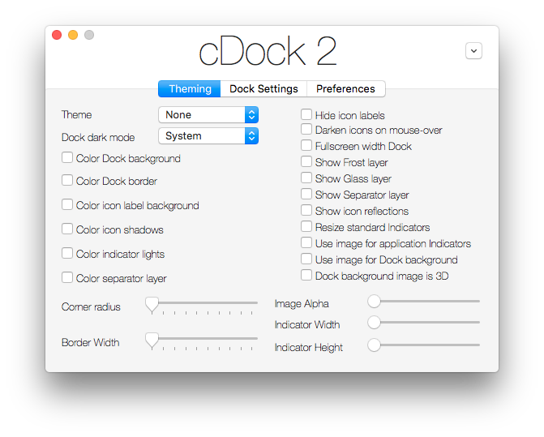

# cDock2

cDock is an application designed to make theming your dock easy and robust on OS X versions 10.9 to 10.11.

# Installation

- Download the latest release of cDock
- Open cDock
    - You may be required to install SIMBL, cDock will do this for you
    - You may be required to disable rootless, cDock will inform you but cannot automate this process
- Theme away

